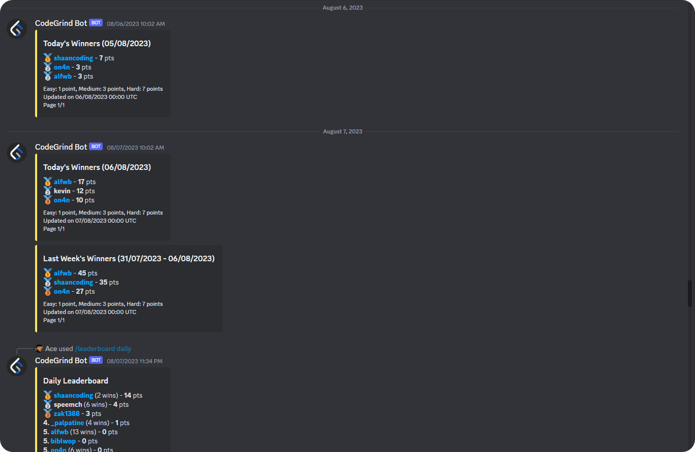

<br/>
<p align="center">
  <a href="https://github.com/CodeGrind-Team/CodeGrind-Bot">
    
  </a>

  <h3 align="center">CodeGrind Bot</h3>

  <p align="center">
    Get ready for an epic coding showdown with the CodeGrind Bot! Compare daily, weekly and all-time stats and conquer LeetCode together in the ultimate quest for coding glory.
    <br/>
    <br/>
    <a href="https://discord.com/api/oauth2/authorize?client_id=1059122559066570885&permissions=947510175826&scope=bot%20applications.commands"><strong>Invite Me To Your Server »</strong></a>
    <br/>
    <br/>
    <a href="https://github.com/CodeGrind-Team/CodeGrind-Bot/wiki/commands">View Full List of Commands</a>
    .
    <a href="https://github.com/CodeGrind-Team/CodeGrind-Bot/issues">Report Bug</a>
    .
    <a href="https://github.com/CodeGrind-Team/CodeGrind-Bot/issues">Request Feature</a>
  </p>
</p>

  

## Table Of Contents

- [Table Of Contents](#table-of-contents)
- [About The Project](#about-the-project)
- [Built With](#built-with)
- [Getting Started](#getting-started)
  - [Initial Setup](#initial-setup)
  - [Database and Browser Configuration](#database-and-browser-configuration)
  - [Virtual Environment Setup](#virtual-environment-setup)
  - [Running the Bot](#running-the-bot)
  - [(Optional) Run Database Utils](#optional-run-database-utils)
- [Contributing](#contributing)
  - [Creating A Pull Request](#creating-a-pull-request)
- [License](#license)
- [Authors](#authors)
- [Acknowledgements](#acknowledgements)

## About The Project



CodeGrind Bot is a Discord bot designed for competitive coding enthusiasts. Using the LeetCode API, it allows users to track and compare their coding stats for daily, weekly, and all-time periods, promoting friendly competition and continuous skill progression.

Created with discord.py, CodeGrind Bot transforms your programming journey into an inclusive, interactive, and engaging experience. It's an open-source project, making contributions from anyone in the community more than welcome - your input can help it grow, improving its capabilities and user-friendliness.

Please note: while the bot uses the LeetCode API for data, it's not officially affiliated with LeetCode. Proper respect for the copyrights and terms of use of LeetCode is expected from all users.

Join us on this coding showdown. Invite CodeGrind bot to your server today, and let the coding quest begin!

## Built With

CodeGrind Bot makes use of several robust and powerful libraries. Key dependencies include:

1. [**Python 3.11.4**](https://www.python.org/): The language in which CodeGrind Bot is primarily written, renowned for its simplicity and versatility.

2. [**topggpy**](https://docs.top.gg/): The official Python library that allows CodeGrind Bot to interact effectively with the top.gg API.

3. [**MongoDB**](https://www.mongodb.com/): An open-source, document-oriented NoSQL database known for handling high volume data storage.

4. [**Motor**](https://motor.readthedocs.io/en/stable/): The Python asynchronous driver used for MongoDB, playing a significant role in assuring efficient data operations.

5. [**discord.py**](https://discordpy.readthedocs.io/en/stable/): A modern, Pythonic library utilized for interactive handling of the Discord API.

6. [**BeautifulSoup4 & bs4**](https://www.crummy.com/software/BeautifulSoup/bs4/doc/): Libraries used for effective data extraction from HTML and XML files, enhancing web scraping functionalities.

7. [**python-dotenv**](https://pypi.org/project/python-dotenv/): Manages environment variables effectively from ".env" files.

Each of these components is crucial in ensuring the smooth operation, efficiency, and utility of CodeGrind Bot.

## Getting Started

To set up a testing version of the bot, you need to follow the steps ahead:

### Initial Setup

1. **Create a Discord application:** Visit [Discord developers applications](https://discord.com/developers/applications) and create an application.

2. **Add bot:** Substitute `<YOUR_BOT_CLIENT_ID>` with your application's client id in the link below and press the link to add it to your selected server.

```
https://discord.com/oauth2/authorize?client_id=<YOUR_BOT_CLIENT_ID>&scope=bot&permissions=8
```

### Database and Browser Configuration

3. **Create a MongoDB database:** Go to [MongoDB](https://www.mongodb.com/), create a database, get the MongoDB URI (connection string), and add your IP address to the IP access list in the network access tab.

4. **Install Chrome:** Chrome needs to be installed on your local machine. Identify the path to your chrome executable. For example, on Windows, it might be `C:/Users/UserName/AppDataLocal/Google/Chrome/chrome.exe`, whereas on Linux, it might be `/usr/bin/chromium-browser`. Remember to convert all backslashes (`\`) to forward slashes (`/`). This path will be used for executing the `/stats` command.

5. **Create a .env file:** Within the project's root directory, create a `.env` file and add the environment variables given below. Replace `<your_discord_bot_token>`, `<your_mongodb_uri>`, and `<path_to_chrome_executable>` with your specific values.

   ```
   TOKEN=<your_discord_bot_token>
   MONGODB_URI=<your_mongodb_uri>
   BROWSER_EXECUTABLE_PATH=<path_to_chrome_executable>
   PRODUCTION=False
   UPDATE_STATS_ON_START=False
   DAILY_RESET_ON_START=False
   WEEKLY_RESET_ON_START=False
   ```

### Virtual Environment Setup

6. **Python version:** Ensure Python version `3.11` or higher is installed on your computer.

7. **Setup a virtual environment:** Install the Python `venv` module and set up a virtual environment. [Here](https://docs.python.org/3/library/venv.html) are the instructions for setting up a Python's virtual environment.

   To activate the virtual environment, navigate to the directory where the virtual environment is located and run the following commands:

   - For Windows:

     ```
     .\env\Scripts\activate
     ```

   - For Unix or macOS:

     ```
     source env/bin/activate
     ```

8. **Install required libraries:** With the virtual environment activated, install all the necessary libraries using the following pip command:

   ```
   pip install -r requirements.txt
   ```

### Running the Bot

9. **Run the bot:** With all the setup complete, run the following command:

   ```
   python main.py
   ```

   You should now be able to execute bot commands on your server.

### (Optional) Run Database Utils

If you wish to run the database utils inside `/tests/database_utils`, follow the steps below:

1. Open a terminal inside the root folder and run the following command:

   ```
   python tests/database_utils/<name_of_file>.py
   ```

2. Provide the required data asked in the terminal.

3. The util should now run successfully.

## Contributing

Contributions are what make the open source community such an amazing place to be learn, inspire, and create. Any contributions you make are **greatly appreciated**.

- If you have suggestions for adding or removing projects, feel free to [open an issue](https://github.com/CodeGrind-Team/CodeGrind-Bot/issues/new) to discuss it, or directly create a pull request after you edit the _README.md_ file with necessary changes.
- Please make sure you check your spelling and grammar.
- Create individual PR for each suggestion.
- Please also read through the [Code Of Conduct](https://github.com/CodeGrind-Team/CodeGrind-Bot/blob/main/CODE_OF_CONDUCT.md) before posting your first idea as well.

### Creating A Pull Request

1. Fork the Project
2. Create your Feature Branch (`git checkout -b feature/AmazingFeature`)
3. Commit your Changes (`git commit -m 'Add some AmazingFeature'`)
4. Push to the Branch (`git push origin feature/AmazingFeature`)
5. Open a Pull Request

## License

Distributed under the GPL-3.0 License. See [LICENSE](https://github.com/CodeGrind-Team/CodeGrind-Bot/blob/main/LICENSE) for more information.

## Authors

- **Kevin Roman** - _BSc Computer Science Undergraduate at Uni of Bath_ - [Kevin Roman](https://github.com/Kevin-Roman) - _Founder_
- **Leo Lungu** - _BSc Computer Science Undergraduate at QMUL_ - [Leo Lungu](https://github.com/leo-lungu) - _Founder_
- **Shaan Khan** - _Fullstack Software Engineer_ - [Shaan Khan](https://github.com/ShaanCoding/) - _Implemented Streaks, Milestones, Verified Roles & Leetcode Embedded Stats_

## Acknowledgements

- [Othneil Drew](https://github.com/othneildrew/Best-README-Template)
- [ImgShields](https://shields.io/)
