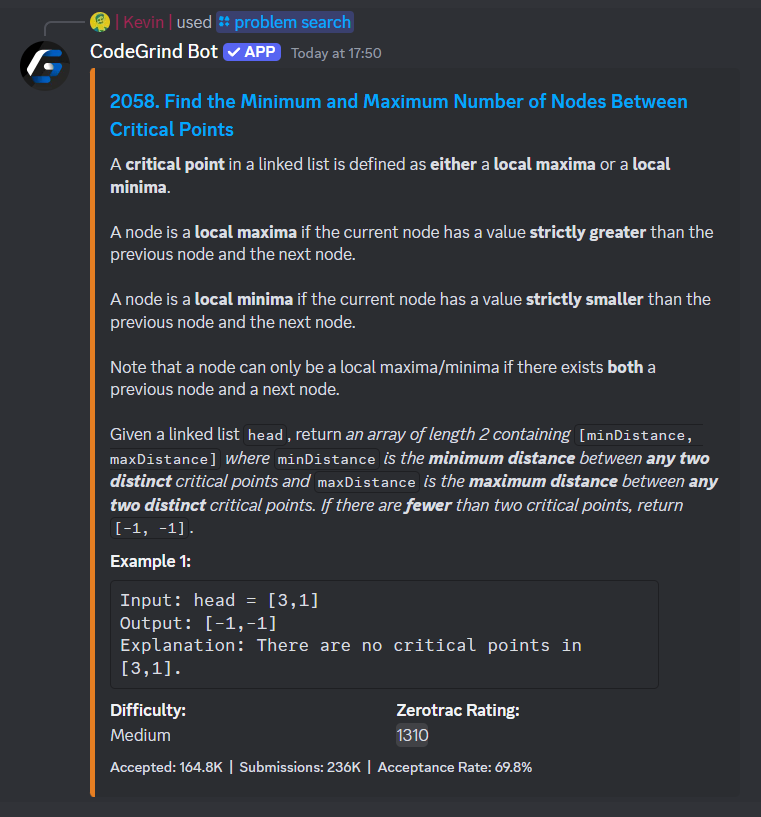
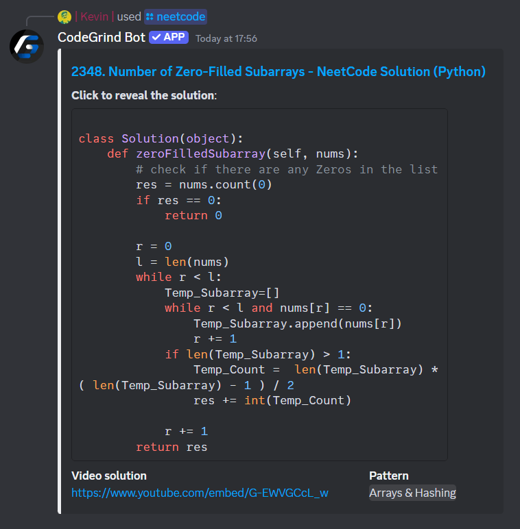
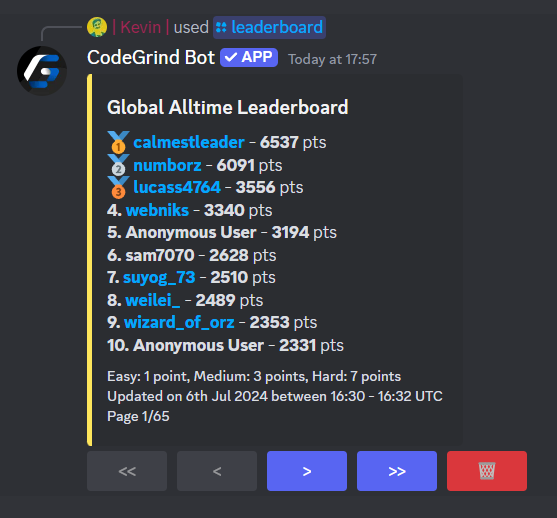

# CodeGrind Bot

   

## About

The all-in-one Discord bot for LeetCode users!
Track progress, compete with friends, and solve coding challenges - directly within Discord.

> Please note: while the bot uses the LeetCode API for data, it is **not officially affiliated** with LeetCode.

### Key Features

* **LeetCode Integration** – Connect your account and view stats, activity heatmaps, and contest history.
* **Leaderboards** – Compete locally in your server or globally across all servers. Filter by daily, weekly, monthly, or all-time, and sort by score or win count.
* **Problem Search & Practice** – Get the problem of the day, pull random problems by difficulty, or search for specific ones instantly.
* **NeetCode Solutions** – Access NeetCode’s high-quality solutions in your preferred language.
* **Progress Roles** – Unlock milestone and streak roles as you grind.

> Use the `/help` command for more detailed information.

### Usage examples

    

        
        
    

    

        
    

## Contributions

Contributions are welcomed and appreciated. Feel free to open a pull request!

### Setting up a Testing Version of the Bot

The steps for setting up a testing version of the bot can be found in our [Setup CodeGrind Bot Locally](https://github.com/CodeGrind-Team/CodeGrind-Bot/wiki/Setup-CodeGrind-Bot-Locally) wiki page.

## License

Distributed under the GPL-3.0 License. See [LICENSE](/LICENSE) for more information.

However, some files are licensed differently. Specifically, [`src/bot.py`](/src/bot.py) and [`src/observability/logging/handlers/console_logger.py`](/src/observability/logging/handlers/console_logger.py) files are licensed under the Apache License 2.0. These files include code from [Python-Discord-Bot-Template](https://github.com/kkrypt0nn/Python-Discord-Bot-Template) and require attribution.

## Acknowledgements

* [LeetCode-Stats-Card](https://github.com/JacobLinCool/LeetCode-Stats-Card)